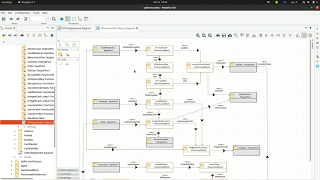

## (Alpha 1) Cybersecurity Risk Assessment Tool

Contains a tool-chain for the cybersecurity risk assessment based on the theory defined in [(paper 0)](../reports).

**Requires**
- z3 python API (https://github.com/Z3Prover/z3/blob/master/README.md)
- Python3
- Modelio (https://www.modelio.org/)

**Create a new Model**
1. Download Modelio (https://www.modelio.org/)
2. Import zip file: [modelio_project_cybersecurity.zip](./alpha_1/modelio_project_cybersecurity.zip)
3. Open the cybersecurity project and inside the Engineering package create a new package 
4. Create a new Deployment Diagram, representing the physical architecture with:
    1. One Node per each agent (subsystem or device, depengind on the granularity of your model) and give them a unique name
    2. Create Input/Output ports on each Node by specifying the Base (double click on the port) as InputPort or OutputPort. Each port needs to have a unique name
    3. Create channels as unidirectional InformationFlow between output and input ports
5. Create an Object Diagram per each Node in the Deployment Diagram where the functional architecture is specified
    1. Create Functional Blocks by adding new Instances with Base FunctionalBlock
    2. Connect Functional Blocks with InformationFlow
    3. Inputs (or hardcoded variables) can be modeled by creating a new Instance of Base Base
    4. Add one Instence of Base InputPort/OutpuPort per each input/output port in the deplyment diagram. We call this sockets and they must have the same name of the port in the Deplyment Diagram that they represent. This connects the functional and physical architecture
    
You can find a **example model** in "Engineering"->"UC1_CPS"

**Run the Analysis**
1. Extract the model by 
    1. right-clicking on the Engineering package, then "Import/Export"->"Export"->"XMI export"
    2. select compatibility UML 2.4.1 and save it as "Engineering.xmi" in the same folder where "alpha_1/secra.py" is located
    3. click "export"
2. go to the directory where the prototype "alpha_1" is located and 
    1. edit line 19 of secra.py changing the variable "spec_package" with the same name of the package you created in step 3 of "create model". save and exit.
    2. run "python3 secra.py"

**Review the results** in the directory output_secra, where:
1. <package_name>_securityAssessment.xlsx - the spreadsheet file with the results of the Risk Assessment (Ctrl-Shift F9 to update the formulas)
2. <package_name>_model.dot - dot file with the model extracted from the XMI (run "dot -Tpdf <package_name>_model.dot <package_name>_model.pdf" to create a PDF)
3. <package_name>_graph.dot - dot file with the relations considered by [our security theory](../reports/report_0) (run "dot -Tpdf <package_name>_graph.dot <package_name>_graph.pdf" to create a PDF)
4. <package_name>_model.out - internal representation of the model
5. <package_name>.out - logging the operations

## (Alpha 0) Prototypes based on V-Research Cybersecurity Theory
Contains formalizations of the ABF Theory published in: https://link.springer.com/chapter/10.1007%2F978-3-319-59294-7_21
There are 3 files with slightly different implementations of the theory:
1. [rcc5_connectsWith_infiniteDomain.py](./alpha_0/rcc5_connectsWith_infiniteDomain.py) uses universal quantifiers for the definition of the RCC5 calculus
2. [rcc5_finiteDomain_mereology.py](./alpha_0/rcc5_finiteDomain_mereology.py) unfolds the quantifiers over a finite domain
3. [rcc5_partOf_infiniteDomain.py](./alpha_0/rcc5_partOf_infiniteDomain.py) is a variation of rcc5_partOf_infiniteDomain.py but builds the theories on top of the part_of relation instead of the connects_with relation.

**Requires**
- z3 python API (https://github.com/Z3Prover/z3/blob/master/README.md)
- Python3
